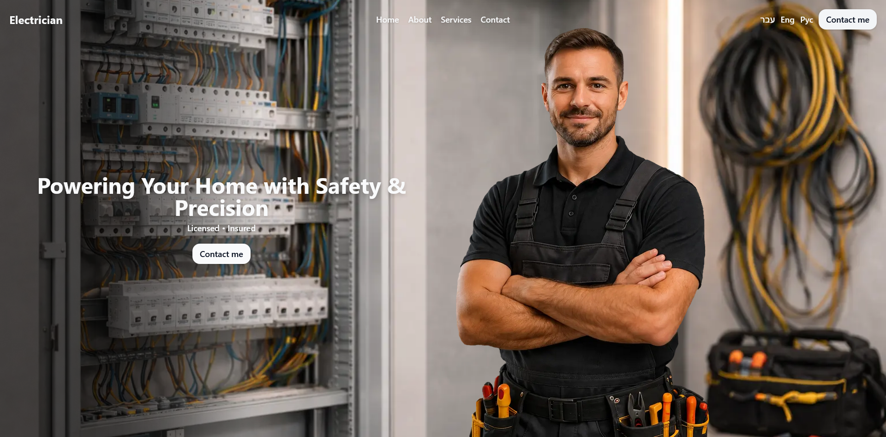
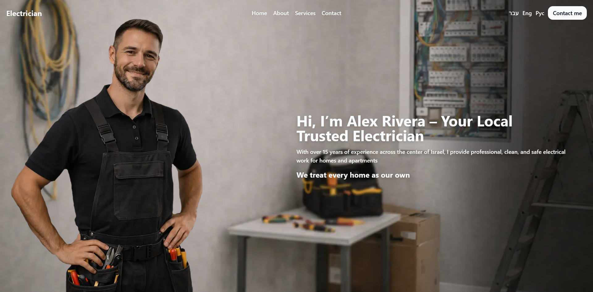
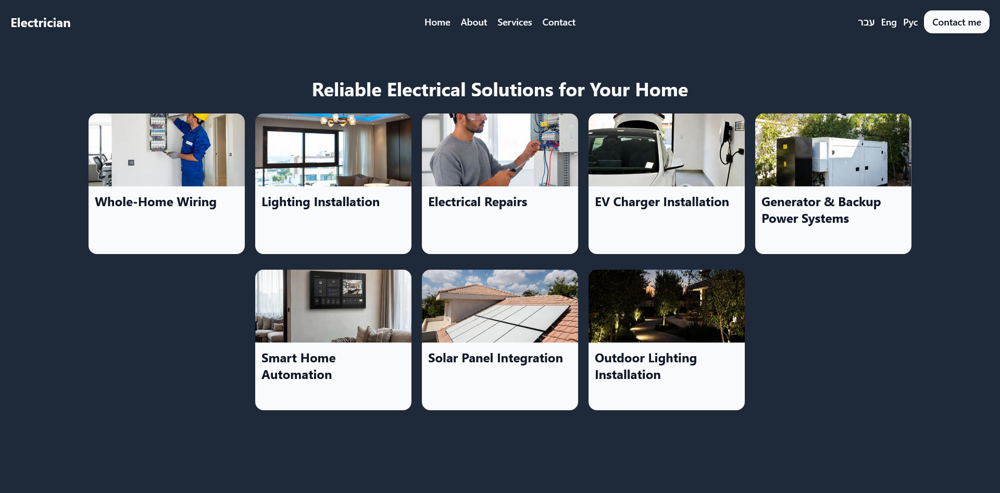
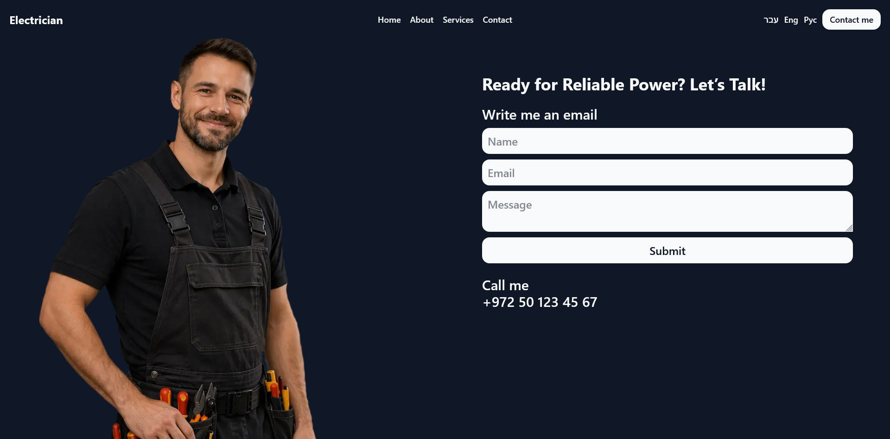

# Electrician Landing Page

A multilingual landing page for a fictional professional electrician built with Next.js.

## Features

### Multilingual Support

- English, Hebrew, and Russian support
- Dynamic content switching via context provider
- RTL support for Hebrew
- Language-based routing (`/en`, `/he`, `/ru`)

### Hero Section

- Strong value proposition headline
- Clear call-to-action button
- Fully responsive layout with background visuals

### About Section

- Personal introduction of the electrician
- Experience and trust-building messaging

### Services Showcase

- Grid-based service cards
- Clickable cards leading to contact section

### Contact Section

- Functional contact form UI (frontend only)
- Name, email, and message inputs
- Call-to-action phone display
- Smooth user flow to communication

### Navigation & UX

- Smooth scroll navigation between sections
- Sticky header with language switcher
- Mobile-friendly hamburger menu

### Animations & UI

- Infinite ticker animation for info highlights
- Smooth hover interactions
- Layered background visuals
- RTL/LTR adaptive layout support

### Responsive Design

- Fully responsive across devices
- Mobile-first layout approach

## Tech Stack

- Next.js
- React
- TypeScript
- Tailwind CSS

## Localization System

All content is stored in a centralized `data.ts` file:

- `en` → English
- `he` → Hebrew (RTL support)
- `ru` → Russian

## Routing

The app automatically handles language routing:

- `/` → redirects to `/en`
- `/he` → Hebrew version
- `/en` → English version
- `/ru` → Russian version

Proxy ensures a default language is always applied.

## How to Run

You can use this project in one of the following ways:

### Option 1: Use the Live Version

Simply open [link](https://electrician-plum.vercel.app/en) in your browser to access the application online

### Option 2: Run Locally

#### 1. Clone the repository

```bash
git clone https://github.com/KreimerR/electrician.git
cd electrician
```

#### 2. Install dependencies

```bash
npm install
```

#### 3. Running the project

Development server:

```bash
npm run dev
```

The application will run at:

```bash
http://localhost:3000
```

## Screenshots





